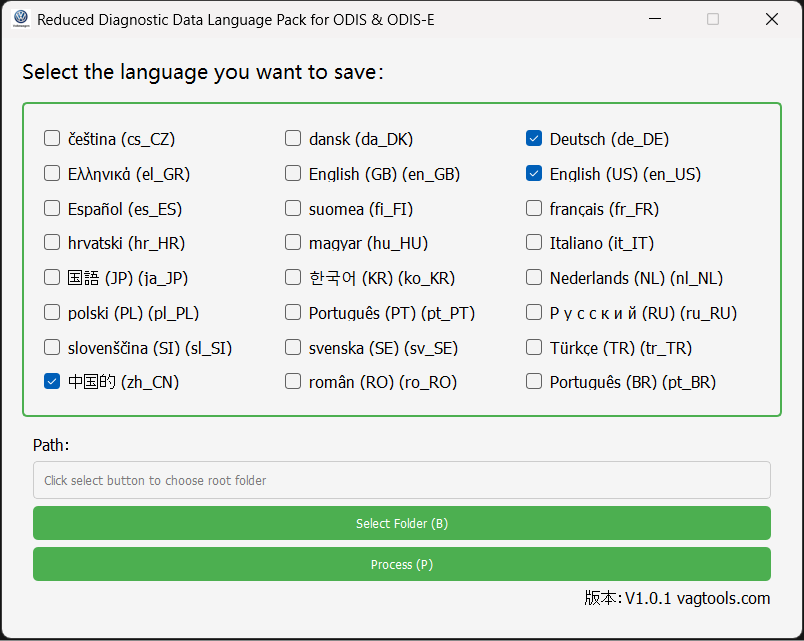

# Reduced Diagnostic Data Language Pack

## Overview
This software is designed to manage and process language packs for ODIS & ODIS-E diagnostic tools. It allows users to select specific languages and remove unnecessary language files from a given directory, saving storage space and improving organization.

[中文介绍](./README.zh.md)


## Screenshots

Here are some screenshots of the software in action:




## Features
- User-friendly GUI for selecting languages.
- Deletes unselected language files from the specified directory.
- Generates a log file of deleted files.

## Build and Packaging Instructions

### Prerequisites
To build and package this software, ensure the following dependencies are installed:
- Python 3.8 or later
- PyQt5

You can install the required dependencies using:
```bash
pip install -r requirements.txt
```

### Packaging
To package the software into an executable, use `PyInstaller`:
```bash
pip install pyinstaller
pyinstaller --hidden-import=win32timezone --onefile --noconsole --icon=src/VW.ico --name=Reduced-Diagnostic-Data-Language-Pack --collect-binaries=pyzbar --add-data "src/VW.ico;src" .\src\Reduced-Diagnostic-Data-Language-Pack.py
```
The packaged executable will be located in the `dist` directory.
